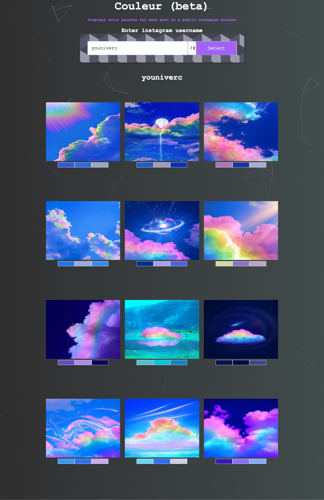
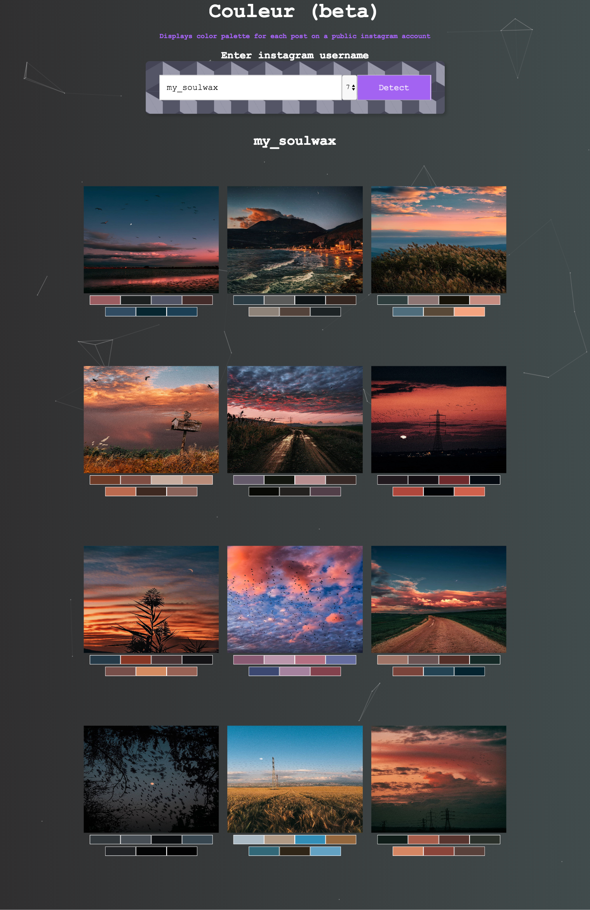

# Couleur Frontend
- Allows a user to enter input and select a palette size
- Makes a request to the backend service (https://github.com/samg9/couleur)
- Displays posts with color palettes, or displays an error message

